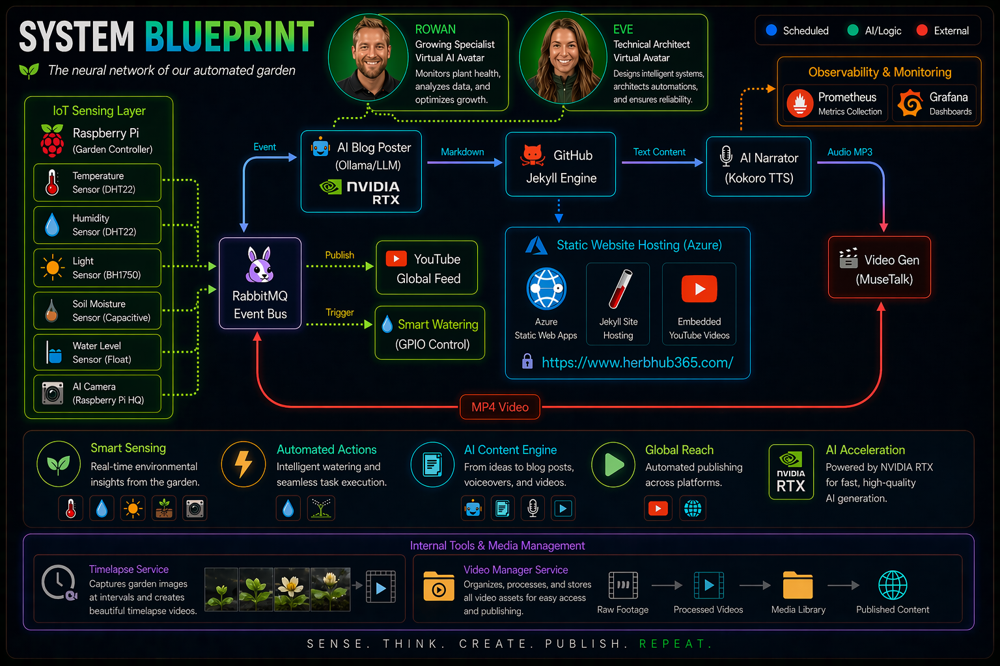
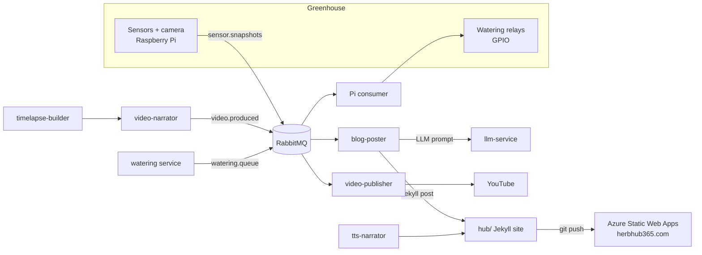

# Herb Hub 365

Herb Hub 365 is a self-hosted, largely autonomous greenhouse platform. Sensors and cameras on Raspberry Pis monitor a real greenhouse (basil, chilli, oregano); a pipeline of Go microservices turns that telemetry into daily AI-written blog posts, audio narration, timelapse videos, and narrated YouTube uploads — all published to [herbhub365.com](https://www.herbhub365.com). The same event bus also drives automated watering of the plants.

This is the root overview. Each major area has (or will get) its own deeper README — see the links in the tables below.

## How it works



The daily content loop:

1. A cron job on the greenhouse Pi captures a sensor snapshot (temperature, humidity, soil moisture, light, water reservoir) and publishes it to the `sensor.snapshots` queue on RabbitMQ.
2. **blog-poster** consumes and archives snapshots, then on a schedule asks **llm-service** (local Ollama with a Gemini fallback) to write a Jekyll blog post — optionally including a photo from that day's timelapse folder — and commits it to `hub/_posts`.
3. **tts-narrator** converts new posts to MP3 narration via a self-hosted Kokoro TTS server and patches the post front matter with an `audio_url`.
4. **timelapse-builder** assembles daily camera stills into MP4 timelapses; **video-narrator** produces an avatar-narrated video (MuseTalk lip-sync + TTS, intro/outro concat) and announces it on the `video.produced` queue.
5. **video-publisher** uploads finished videos to YouTube and links them back into the blog post.
6. Pushing to `main` triggers the static site deploy of the `hub/` Jekyll site.

The watering loop runs independently: the **watering** service polls soil-moisture metrics and publishes watering commands to `watering.queue`; a consumer on the greenhouse Pi pulls commands and pulses the correct relay via GPIO. The **watering-tui** support tool provides manual control.

## Repository layout

| Path             | What it is                                                                                                                                                                                                                                                           | Docs                                                 |
| ---------------- | -------------------------------------------------------------------------------------------------------------------------------------------------------------------------------------------------------------------------------------------------------------------- | ---------------------------------------------------- |
| `hub/`           | The public Jekyll site (posts, layouts, live sensor data, Prometheus chart includes). Deployed to Azure Static Web Apps at herbhub365.com.                                                                                                                           | —                                                    |
| `services/`      | Go microservices that make up the platform (see table below).                                                                                                                                                                                                        | Per-service READMEs                                  |
| `docker/`        | Docker Compose stack for the main server plus supporting infrastructure: Traefik (TLS ingress), RabbitMQ, Cronicle scheduler, Homepage dashboard, cAdvisor, and a Prometheus agent. `docker-compose.gpu-narrator.yml` runs video-narrator on a separate GPU machine. | —                                                    |
| `scripts/`       | Raspberry Pi–side scripts: sensor snapshot capture and RabbitMQ publishing, the watering queue consumer, the GPIO relay wrapper, timelapse building, and cron setup.                                                                                                 | —                                                    |
| `IaC/`           | Terraform for the Azure resources (resource groups, storage, static site backing).                                                                                                                                                                                   | —                                                    |
| `support-tools/` | Operator utilities, currently the watering TUI/CLI client.                                                                                                                                                                                                           | [watering-tui](support-tools/watering-tui/README.md) |
| `docs/`          | Architecture diagrams, the timelapse guide, and the GPU narrator migration guide.                                                                                                                                                                                    | [docs/](docs/)                                       |
| `Resources/`     | Logos, the platform map image, and video overlay assets.                                                                                                                                                                                                             | —                                                    |

## Services

All services are Go, each with its own `dockerfile`, wired together in `docker/docker-compose.yml`.

| Service             | Role                                                                                                                                                                                | Docs                                                    |
| ------------------- | ----------------------------------------------------------------------------------------------------------------------------------------------------------------------------------- | ------------------------------------------------------- |
| `llm-service`       | HTTP gateway to LLM providers (`POST /generate`, image support). Local Ollama first, Gemini fallback.                                                                               | [README](services/llm-service/README.md)                |
| `blog-poster`       | Consumes sensor snapshots, archives them, and generates daily Jekyll posts via the LLM. Extra modes for Prometheus metrics posts and repo-explainer posts. Can commit/push via PAT. | [README](services/blog-poster/README.md)                |
| `tts-narrator`      | Narrates posts to MP3 via Kokoro TTS and embeds an audio player in each post.                                                                                                       | [README](services/tts-narrator/README.md)               |
| `timelapse-builder` | HTTP service that builds MP4 timelapses from dated folders of camera stills with ffmpeg.                                                                                            | [Guide](docs/TIMELAPSE-GUIDE.md)                        |
| `video-narrator`    | Produces avatar-narrated videos from posts (TTS + MuseTalk lip-sync, chroma key, intro/outro concat). Runs on the main server or a GPU machine.                                     | [Migration guide](docs/gpu-video-narrator-migration.md) |
| `video-publisher`   | Consumes `video.produced`, uploads videos to YouTube, and links them back into blog posts.                                                                                          | —                                                       |
| `herbhub-manager`   | Web UI/API at manager.herbhub365.com orchestrating post, timelapse, and video generation.                                                                                           | —                                                       |
| `watering`          | Monitors soil-moisture metrics and publishes watering commands when plants are dry.                                                                                                 | —                                                       |

## Running the stack

The main stack runs on the home-lab server via Docker Compose:

```bash
cd docker
# edit .env to configure credentials, LLM endpoints, and host mounts
docker compose up -d
```

Traefik terminates TLS and routes the `*.herbhub365.com` hostnames (RabbitMQ UI, scheduler, dashboard, manager, timelapse). The `herbhub` Docker network is external and must exist first. Greenhouse Pi setup (sensor cron, watering consumer) lives in `scripts/`.

To preview the site locally:

```bash
cd hub
bundle exec jekyll serve
```

## Infrastructure

- **Hosting:** Azure Static Web Apps for the public site; Azure Blob Storage for generated media (images, audio, chart data) so the repo stays lean.
- **Messaging:** RabbitMQ is the backbone — `sensor.snapshots`, `watering.queue`, and `video.produced` connect the Pis, the content pipeline, and the publishers.
- **Observability:** node exporters on the Pis, cAdvisor and a Prometheus agent in the stack, remote-writing to a central Prometheus. The SRE plan in `WIP-SRE/` defines the SLOs and alerting roadmap.
- **Provisioning:** Terraform in `IaC/` manages the Azure side.
